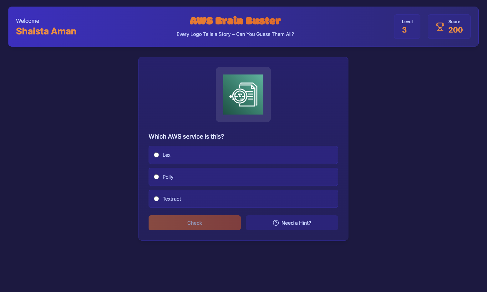
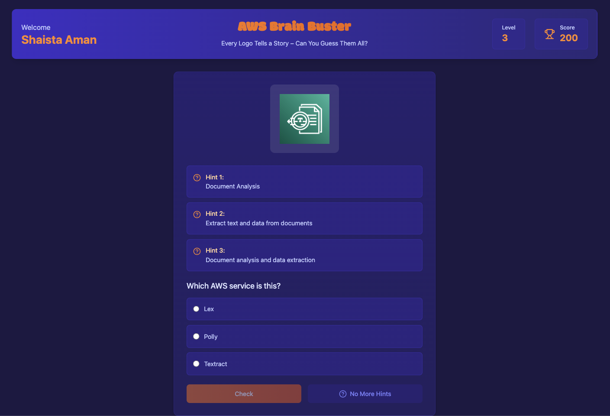
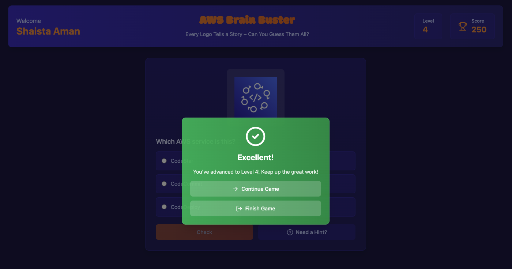
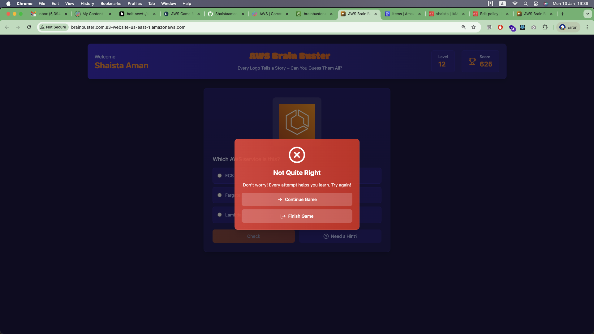
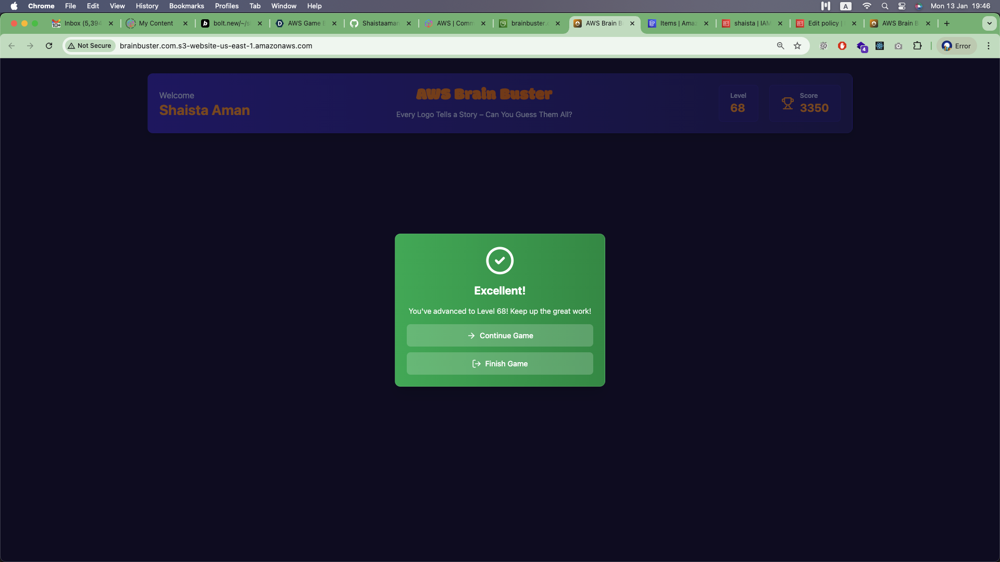

#Inspiration
The inspiration for "AWS Brain Buster" came from the growing need for cloud literacy in today's tech-driven world. As AWS services continue to expand, we wanted to create an engaging and interactive way for individuals to familiarize themselves with these services. By gamifying the learning process, we aim to make it fun and competitive, encouraging players to enhance their knowledge of AWS.

#What it does
"AWS Brain Buster" is a guessing game where players are presented with the logos of various AWS services along with hints. Players must identify the service based on the logo and hints provided. Correct answers allow players to progress through levels, while incorrect answers deduct points from their initial score of 100. The game is designed to challenge players' knowledge of AWS services and promote learning through play.

#How we built it
We built "AWS Brain Buster" as a typesript application. The front-end interface was developed using HTML CSS and typescript, allowing for a dynamic and responsive user experience. The game logic is handled at client side, which manages user interactions, score tracking, and the display of hints. This reduces the client-server interaction and make game light weight to play. We utilized AWS DynamoDB to store the AWS service names and hints, enabling efficient data retrieval and updates, and Amazon S3 for storing AWS service logos and front end hosting. Additionally, we implemented a leaderboard feature to track player scores and foster competition.

For development assistance, we leveraged Amazon Q to help with code snippets, streamline our workflow, when needed for additional support. The design emphasizes vibrant visuals and user-friendly navigation to enhance the overall gaming experience.

#Challenges we ran into
One of the main challenges we faced was ensuring that the hints provided were neither too easy nor too difficult, striking a balance that would keep players engaged. Additionally, we encountered difficulties in designing a layout that would work seamlessly and look great on different devices. Debugging the scoring system to ensure accurate point deductions and rewards also required significant testing and iteration.

#Accomplishments that we're proud of
We are proud of creating an interactive and visually appealing game that effectively combines education and entertainment. A significant achievement was the successful implementation of the scoring system and the ability to provide instant feedback to players based on their performance.

Additionally, we are particularly proud of our first-time use of Amazon Q and other AWS services, which enhanced our development process and allowed us to build a more robust and scalable application. This experience has deepened our understanding of cloud technologies and their practical applications in game development.

#What we learned
Throughout the development of "AWS Brain Buster," we learned the importance of user feedback in shaping the game experience. Iterating on our initial design based on player input helped us refine the gameplay mechanics and improve overall engagement.

Additionally, we gained valuable experience working with AWS services, including our first-time use of Amazon Q, which provided insights into cloud-based development. This project also enhanced our skills in front-end development and taught us how to effectively integrate various technologies to create a cohesive and engaging application.

#What's next for AWS Brain Buster
Looking ahead, we plan to expand "AWS Brain Buster" by adding more AWS services and logos to keep the game fresh and challenging. We also aim to incorporate multiplayer features, allowing players to compete against friends or other users in real-time.
